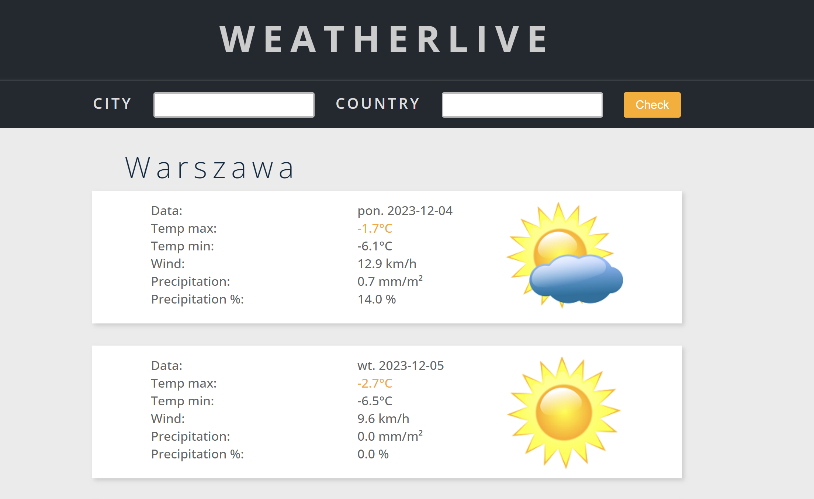
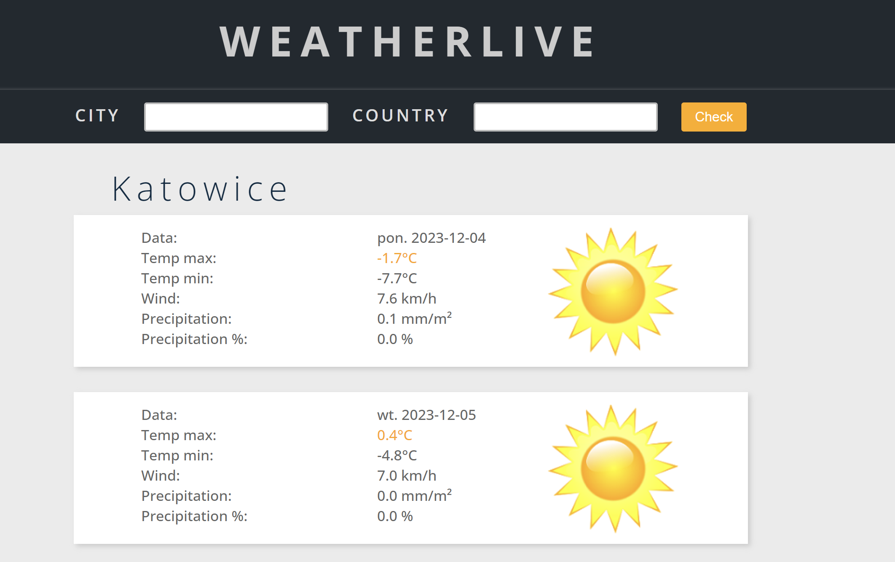
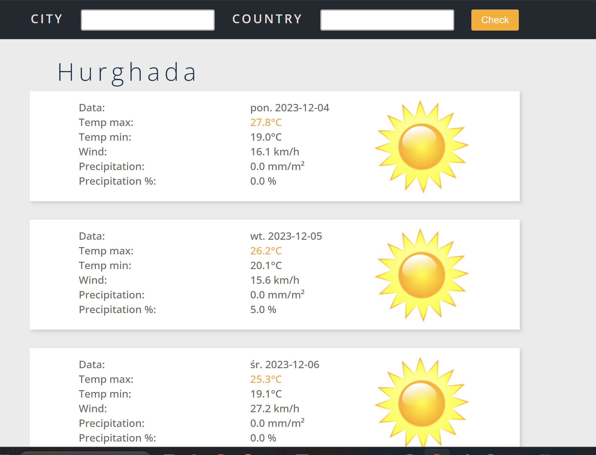

# WeatherApp
## Overview
* [About](#general-info)
* [Technologies](#technologies)
* [Properties](#properties)
* [Setup](#setup)
* [How it works](#how-it-works)

## About

This application shows the weather for 5 days based on the city that the user enters in the frontend.
Unfortunately, the API I am using occasionally returns coordinates for cities that do not exist. I will change the server in the future.

## Technologies
* Java 17
* Spring Boot 2.7
* Maven
* RestClient

## Properties:
apiKey=your_api_key 

## Setup
How to run ?
To run need ApiKey form api.opencagedata.com (it's a service name) Need only to create account and generate ApiKey. 

With set properties, just run app.

## How it works
1. Enter city name nad country, in basic it's Poland and Warsaw

2. Check the weather for the next 5 days; we have information about temperature, wind, and precipitation for every city in the world.